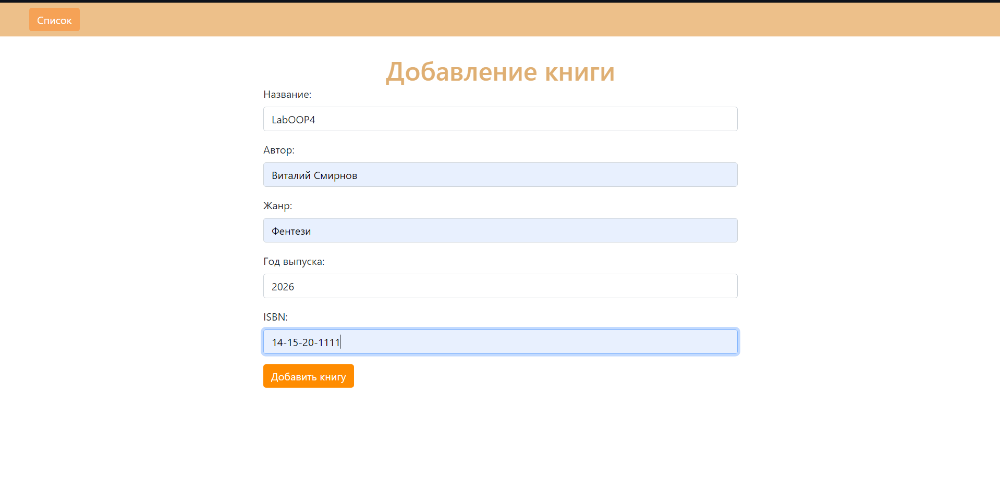
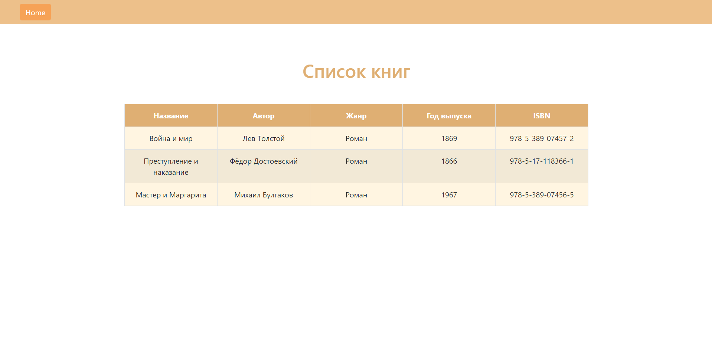
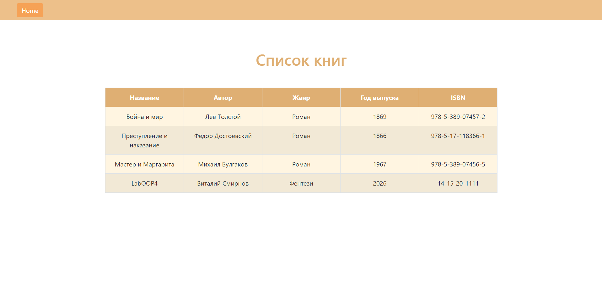
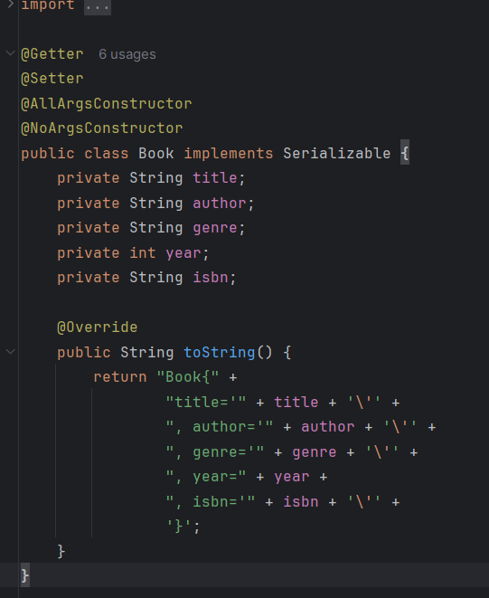

Разработать страницу, отображающую список книг, с хранением их на сервере файле. передача данных осуществляется
по JSON, клиент и сервер общаются по средством передачи данных. Применить шаблон проектирования MVC. На странице 
предусмотреть форму добавления объектов в список.
Добавлен класс Book выполняет роль части Model. В частности, класс Book представляет собой объект модели, 
который описывает свойства книги и включает в себя методы для работы с этими данными.

